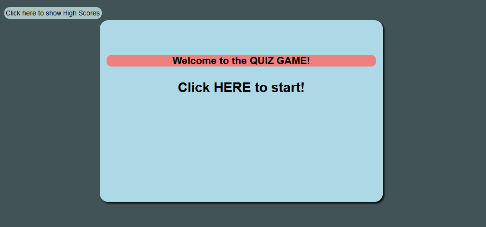
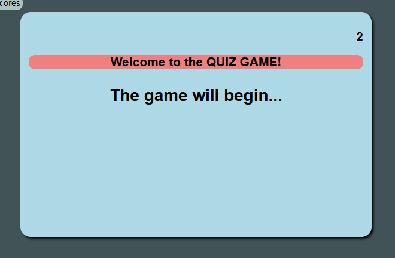
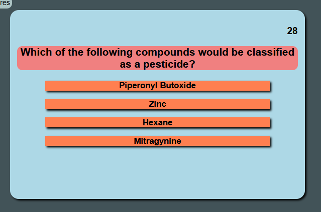
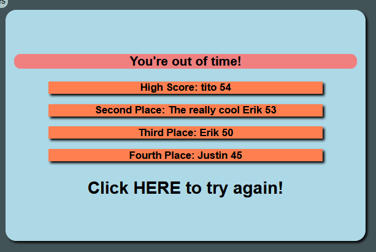

# Javascript Quiz Game!

Erik Portillo, 2020

## Introduction

This is a quiz game created in Javascript. In it the user will be asked a series of challenging questions related to Analytical Chemistry. The score is the time remaining once the quiz is over, starting with 60 seconds, the game ends if the counter reaches 0! If incorrect answers are given time is stricken from the timer! Answer quickly and try for a high score!

## Visual Guide

### When the page is loaded you can either start the quiz or look at previous high-scores (scores stored in local storage).

### The game counts-down before it starts, preparing the user to get ready to answer questions!

### The questions are then loaded. Click on the correct answer if you can!

### Game Over! The high scores are shown. Click anywhere on the game field to try again. Can you get a high score?

## How it Works

### Javascript in Action

When the page loads, Javascript creates the elements seen on the page that will be referenced throughout the game. Objects are used to store Questions and *Game Status*. Of critical signifigance are the "answer" elements, created with unique IDs that are referenced in their assigned onClick events, used during the game. Additionally, three other functions are defined:

**showHighscores:** this simply displays the local storage object onto the "answer" elements

**preGame:** runs the "pre-game" event that counts-down to the startTimer event, letting the user know to expect the game to begin. This is a "set interval" function.

**startTimer:** the main game. This contains a "set interval" function within. Each interval checks the *Game Status* object. If Question Answered = False in that interval an IF will set the question and answers to the next question, referencing the *Game Status*. Each answer onClick refers to itself (this.id) and the *Game Status* object to check if the current Correct Answer is a match with that element's id. This is how it determines a correct answer. A visual que is used to show the user that they answered correctly/incorrectly.

If the user completes the quiz or runs out of time the game ends. Their score is shown if time remaining > 0. If a high score is detected the local storage will be updated with the new scores.

The game then can be started again.

Critical to the game is the *Game Status* object which is the "memory" so that the set-interval and on-click events can "know" what to do at each interval or when it is clicked. Once any updating occurs the *Game Status* is also updated.

### CSS for Visual Cues

Classes and IDs are used in CSS to display visual ques for the user. Buttons are NOT used, only basic elements. When clicked, classes are applied to visually that helps the user get the "feeling" that it was clicked.

## Credits

Erik Portillo,
University of Oregon Coding Bootcamp,
12-03-2020